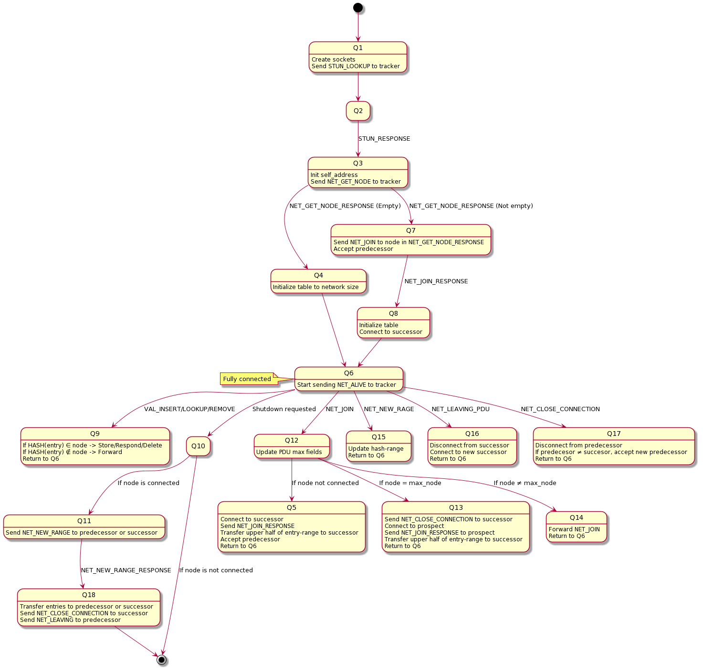
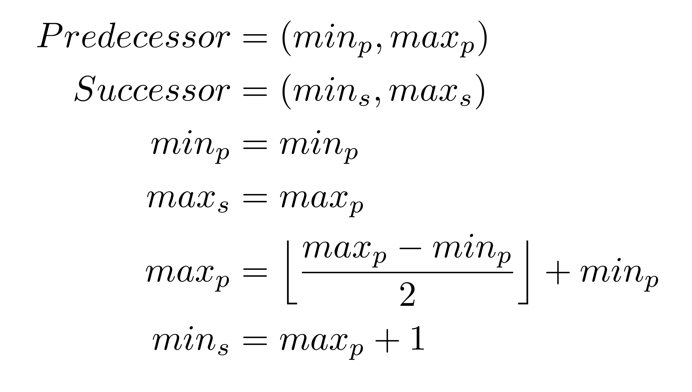
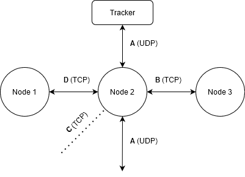

# Distributed hash table

Hash tables are a very efficient and common data structure for storing data.
Distributing a hash table is a common way to balance the load and allow for data
redundancy. This assignment aims to implement a distributed hash table
with a given interface and operations.

The distributed hash table has two different kinds of agents; nodes and
trackers. A node is a data container in the distributed hash table that
can function as a standalone network-accessed hash table, or, form a distributed
hash table with other nodes. A tracker allows other nodes to acquire
information about other nodes and the network. The tracker provides two main
services to the nodes, namely, a node lookup of a node connected to the
tracker, along with a `STUN` like service for address lookup. The `STUN`
service allows a node to request its own public address from the tracker. This address can be exploited by other nodes to connect.

# Data

The data stored in the distributed hash table -also known as table entries- are
defined as follows:
* SSN (YYYYMMDDXXXX),
* Name,
* Email.

SSN acts as the key of the corresponding name and email value-pair. The key is hashed with the djb2-algorithm.

# Node functionality

The network consists of a series of connected nodes. Each node
has a successor and predecessor node.
The network is dynamic, meaning that nodes can be inserted or removed at any given point. Nodes should therefore support insertion and removal of successors and predecessors. The maximum size of the network is 256 nodes, sharing a hash range of 0-255.

The node should naturally also accommodate for insertion, removal, and lookup of table entries in the distributed hash table.

To facilitate above functionality, nodes and trackers (and possibly other agents implementing the same interface) communicate by means of sending _Protocol data units_
(`PDU`s). `PDU`s are messages with predefined structure and semantics. A
full description of the `PDU`s used in this assignment can be found in the
[PDU-specification](pdu_specification.md).

## Node state machine
A node can be represented as a state machine, where `PDU`s transition the node
between different states (with some exceptions). Implementing the node as a state machine makes the
code easier to debug and hopefully less error-prone. A graphical representation
of the node as a state machine follows in the figure below.



### Initiation of node

The initialization process starts with the node sending a `STUN_LOOKUP` request to the
tracker to acquire its own public address. Upon receiving the `STUN_RESPONSE` with its
address, the node sends a `NET_GET_NODE` message to the tracker to get an entry point -another connected node- of the network. The response message from
the tracker contains the necessary information to join the
network.

An empty `NET_GET_NODE_RESPONSE` message indicates that there currently is no other connected node in the network.
However, upon receiving a non-empty response, the node
sends a `NET_JOIN` message to the indicated entry point, exploiting the information included in the `NET_GET_NODE_RESPONSE` from the tracker. Next, the node waits for an incomming connection from its new predecessor in the network.
Once successfully connected with the predecessor, the predecessor transmits a `NET_JOIN_RESPONSE` message, containing the neccesarry information on the new successor of the node. The predecessor also sends along any data entries that belong to the new node. 

When the new node is connected to its successor,
the node is considered alive and should start sending `NET_ALIVE` messages to the tracker.


### Alive messages

A node can send alive messages to a tracker to allow other agents to interface with
the network. All connected nodes do not necessarily have to send alive messages to
the tracker, as only one node should suffice as the entry point of the network. However, by
allowing multiple nodes to interact with the tracker, the tracker can perform load balancing of incoming
traffic.


### Insertion of a new node

Any alive node should be able to receive `NET_JOIN` messages over `UDP`. The `NET_JOIN` message signals that a
new node wants to join the network. The new node is inserted as a successor of
the node with the largest hash range in the network. 

The network has to locate the connected node with the largest hash range to facilitate this behaviour. Upon receiving a `NET_JOIN` message (over `UDP` or `TCP`) a connected node inspects the fields `MAX_SPAN`, `MAX_ADDRESS` and `MAX_PORT`. If the fields do not match the connected node's span, address and port, the connected node updates the fields (if the node's hash span exceeds the current value of `MAX_SPAN`) and forwards the message over `TCP`. 

If the fields do match, the connected node is the node with the largest hash range. The receiver should then close the connection to its
successor using the defined close sequence in `Q13` and connect to the prospect. Once connected to the new successor or prospect, the receiver sends a `NET_JOIN_RESPONSE` to the
prospect with information on its previous successor.


### Handle hash table request

A node listens for incoming value `PDU`s over `UDP`, corresponding to
the insertion, removal, and lookup operations. If the key is outside of the
receiver's hash range, the receiver forwards the message its successor.
Else, the receiver performs the desired operation on its hash table
and sends back an appropriate response to the sender (if so expected).

### Distribution of the hash range

When a node connects with a new successor, a part of the hash range is transferred
to the new successor. The transfer is accomplished by taking the upper half of the
node's hash range and sending it to the successor. The transmission of the
entries is performed using `VAL_INSERT` messages. 

By always inserting new nodes as the successor to the node with largest hash span, we try to fairly distribute the data over all nodes.

The new hash ranges of a predecessor and successor, when inserting a new
node in the network, is calculated as follows:




### Leaving procedure
Nodes should be able to leave the network without the user losing data (as long as one node remains left). This which means that the data entries
stored in the leaving node must be transmitted to another agent of the network. The node can either transfer its hash range to its successor or predecessor.

The node should first update the hash range of the node
that is to take over the range by using a `NET_NEW_RANGE` message to said node.  All stored entries in the leaving node should
then be transferred to the receiving node using `VAL_INSERT` messages. Next, the
node should close the connection to its successor, using the defined `NET_CLOSE_CONNECTION` 
message. After the connection to the successor has been closed, the node should
send a `NET_LEAVING` pdu to its predecessor containing the connection info of its
successor (the successor of the leaving node).


### Disconnection of predecessors and successors
Before a socket connection can be closed between two nodes, a
special message telling the remote to close the connection must be transmitted
over the connection before it can be closed.

### Sockets
A node has multiple sockets for communication with the tracker and other nodes,
more specifically it has four sockets. One for sending alive `PDU`s
periodically to the tracker and incoming `PDU`s over `UDP`, two for maintaining a
`TCP` connection to its predecessor and successor respectively and one final `TCP` listening
socket for accepting successors. 

The successor and predecessor sockets are
recreated as new nodes join or leave the network. The figure below pictures a node
that is fully connected into the network, meaning that the node has joined the network
and has established connection to the predecessor and successor.

Sockets:

* A is used for sending/receiving messages to/from the tracker. It is also
used for receiving messages from agents outside of the network, and to
subsequently respond to them.
* B is used for sending/receiving messages to/from the successor.
* C is used for accepting new connections over TCP.
* D is used for sending/receiving messages to/from the predecessor.



# General rules

There are many implicit and explicit rules of the distributed hash table, some
of the most important ones are listed below.

* Only one insertion of a node is performed at a time.
* SSN is represented as 12-bytes, YYYYMMDDXXXX, **no null termination**.
* Name and email fields are at most 255 characters, **no null termination**.
* Invalid `PDU`s can be dropped without response.
* All port fields are transmitted in `network byte order`, also known as `big-endian`.
    * It is crucial that you handle this correctly, as the communication will not function
      if there is cross-network varying byte order.
    * Check the `htons` and `ntohs` functions in C

**Note:** It is assumed that no `PDU` sent over `UDP` can get corrupted or get dropped.

# Given code

Some parts of the distributed hash table are given with the assignment, these
include a fully implemented tracker (and a client to interact with the tracker), `PDU` definitions as well as
a hash table implementation in C. You are not required to use this given code, as long
as your implementations follow the given protocol and are compatible with
existing code. There is also a sample implementation of a node provided for
testing purposes, which is provided as a src-code to be compiled. You'll find these under [Resources](Resources)


# Requirements

* The network does not have to handle crashes, but no data is allowed to be lost when nodes
join or leave the network, as long as there is one node left in the network.
* PDUs must be read using buffers. One node sending a PDU one byte every 10 seconds should not prevent
the receiving node from handling PDUs from another node.
* Sockets must be managed using the `poll` API. See [poll(2) - Linux manual page](https://man7.org/linux/man-pages/man2/poll.2.html)
* The TCP-sockets should be set to nonblocking, typically realized by setting the `O_NONBLOCK` flag
using [fcntl](https://man7.org/linux/man-pages/man2/fcntl.2.html)
* There must be no interface-breaking changes as your implementation is expected to work with other student's implementations. (Test this yourself.)

Your implementation should be able to start using the following terminal
commands:

```bash
./node <tracker address> <tracker port>
```
